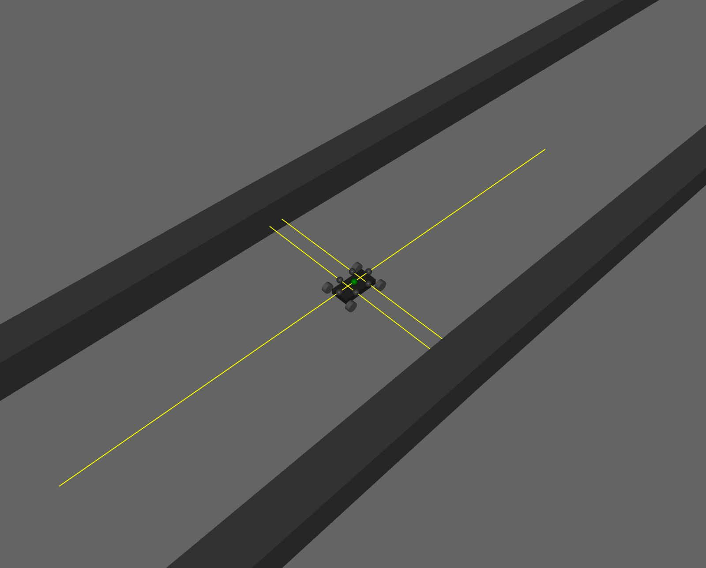

# DRL TurboEngine

A Deep Reinforcement Learning (DRL) engine to train agents on high-speed navigation tasks using custom track environments. 

---

## Overview

- **Custom Race Environment** built in MuJoCo
- **Agent Training Pipeline** with reward functions, environment loops, and episode management
- **Deployment Module** to run trained policies in real-time
- **Track Assets** in both **STL** and **XML** formats
- **Testing Scripts** for validating performance

## How It Works
### 1. **Environment**
The `TurboRaceEnvironment` simulates a racing-style track system. It provides:
- Observations
- Rewards
- Actions
- Episode logic

You can modify the track design, boundaries, and rules.

### 2. **Training**
`TurboTraining.py` handles:
- Agent initialization
- Episode loops
- Reward computation
- Logging & saving checkpoints

### 3. **Deployment**
`TurboDeploy.py` loads the trained model and runs it over the track for visualization or benchmarking.

---

###  Rover Image
An image showcasing the rover used during training.

###  Navigation Demo Video
A video of the rover navigating through the track.

## Curretnly Working on/Future Improvements
- Training the agent on different tracks and generalizing the behaviour to perfrom on any track.
- Deplyoing and testing of agent on Hardware.

